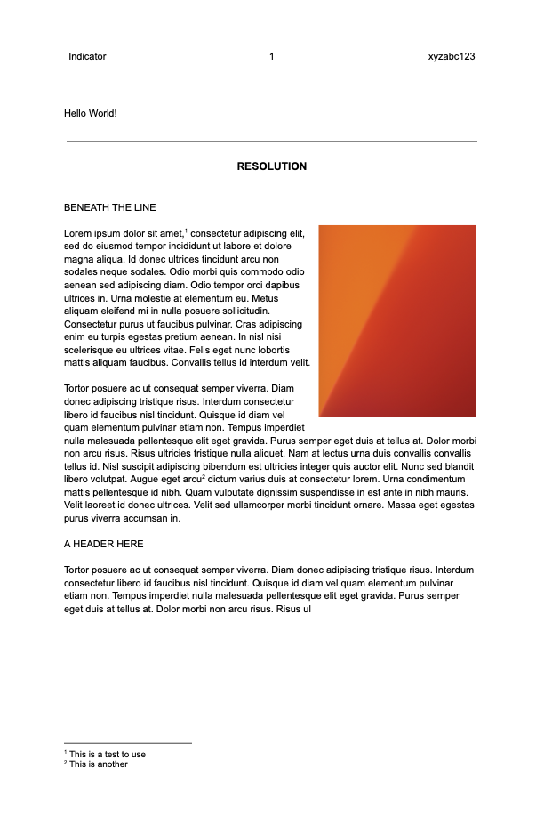
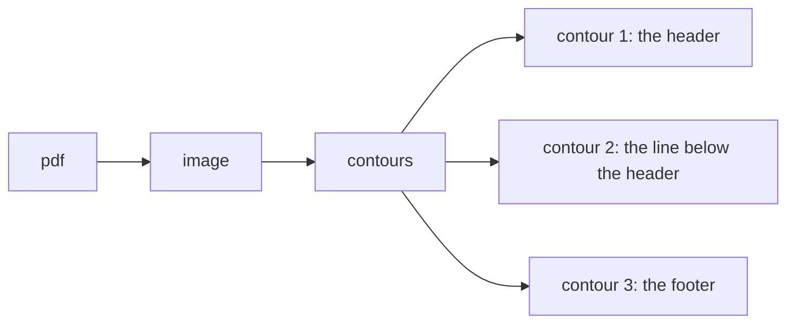
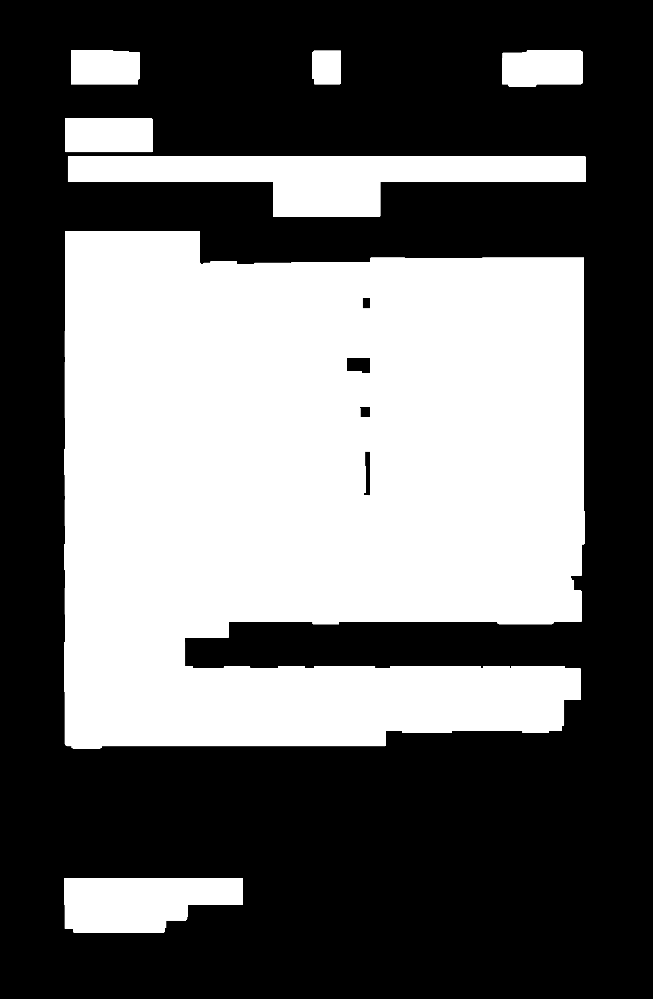
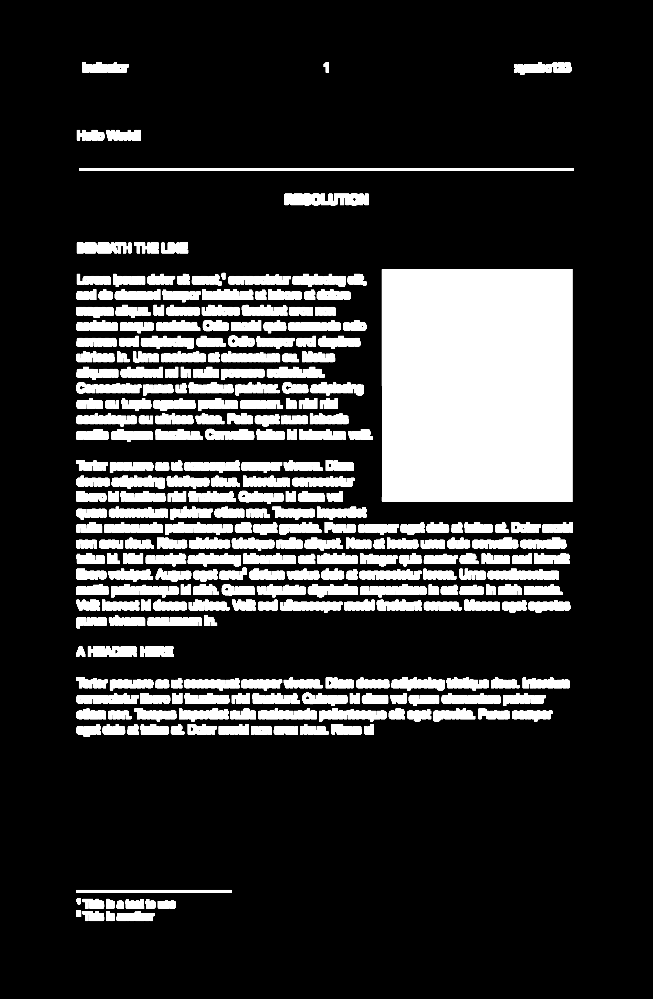
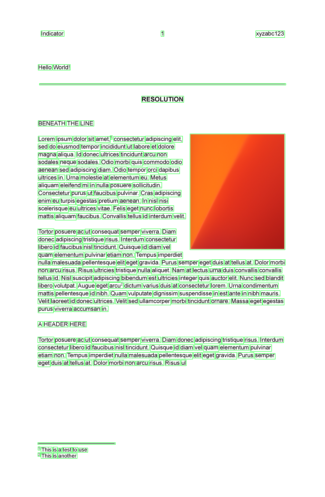
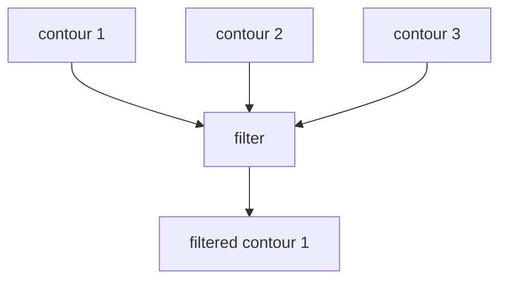

# start-ocr Docs

!!! warning "Caveat"

    _ImageMagick_ [setups](./setup.md) vary:

    1. `homebrew`-based installation
    2. `Dockerfile` compiles from source
    3. Github action `main.yml`

    This makes some tests janky so have to be a bit creative, e.g.:

    ```py title="Sample docstring"
    >>> contours = get_contours(im, (10,10))
    >>> len(contours) in [222,223] # So one installation outputs 222 and the other 223
    True
    ```

    Ideally, this would consistent. Will have to circle back on this another time.

## Sample PDF

A simple file is included in the `/tests` folder to demonstrate certain functions:



## `fetch.get_page_and_img()`

:::start_ocr.fetch.get_page_and_img

## `slice.get_contours()`

### Mental Model



### Conversion

Converting the pdf to an image format enables `get_contours()`. Contours can be thought of as tiny fragments within the document that delineate where certain objects in the document are located.

### Show Contours

To demonstrate `get_contours`, I created a helper `show_contours` which just prints out where the contours are found given a _rectangle size_ that we want to use for the image.

!!! note "`100 x 100` yields 7 contours"

    ```py title="100 x 100"
    >>> from start_ocr import get_page_and_img, show_contours
    >>> page, img = get_page_and_img(pdfpath=p, index=0)
    >>> rectangle_size_lg = (100,100)
    >>> contours = show_contours(img, rectangle_size_lg) # runs get_contours()
    ```

    `dilated` | `contours`
    --:|:--
     | 

!!! note "`10 x 10` yields 285 contours"

    ```py title="10 x 10"
    >>> from start_ocr import get_page_and_img, show_contours
    >>> page, img = get_page_and_img(pdfpath=p, index=0)
    >>> rectangle_size_sm = (10,10)
    >>> contours = show_contours(img, rectangle_size_sm) # runs get_contours()
    ```

    `dilated` | 285 `contours`
    --:|:--
     | 

### `get_contours()`

!!! tip "Explaining dilation and contours."

    The function follows the strategy outlined in [Python Tutorials for Digital Humanities](https://www.youtube.com/@python-programming).
    A good explanation on how dilation works is found in this [Stack Overflow answer](https://stackoverflow.com/a/57262099) by [@nathancy](https://stackoverflow.com/users/11162165/nathancy).

:::start_ocr.slice.get_contours

## Filtering contours

Each contour can be filtered further to arrive at rectangles that meet the filter criteria:



For instance, we can try looking for a long horizontal line matching some criteria:

1. If we imagine the page to be divided into 3 equal vertical slices, the line must start at the first slice and end in the third slice.
2. If we imagine the page width to be of X width, X/2 is simply half this width.

Let's say we want to look for a line that is greater than half the page width (2), positioned with edges along (1):

```py title="Filtering mechanism in practice" linenums="1" hl_lines="8 9 10"
imgs = []
page, img = get_page_and_img(pdfpath=p, index=0)
contours = get_contours(img, (10, 10), test_dilation=True)
_, im_w, _ = img.shape
for cnt in contours:
    x, y, w, h = cv2.boundingRect(cnt)  # unpack each contour
    filtering_criteria = [
        w > im_w / 2,  # width greater than half
        x < im_w / 3,  # edge of line on first third vertical slice
        (x + w) > im_w * (2 / 3),  # edge of line on last third vertical slice
    ]
    if all(filtering_criteria):
        obj = CoordinatedImage(img, x, y, w, h)
        obj.greenbox()
        imgs.append(obj)
cv2.imwrite("temp/boxes.png", img)
```

The [`CoordinatedImage`](./coordinates.md) is a data structure to compute _related_ values of `x`, `y`, `w`, and `h`.
